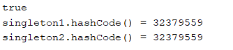
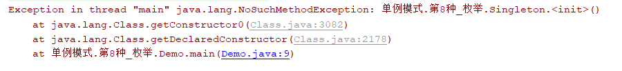

# 单例模式 

## 概念

所谓类的单例设计模式（Singleton），就是**保证一个类仅有一个实例**，并提供一个访问我它的全局访问点。

不允许去new它，只能通过一个（静态）方法来获取它的对象实例，如果某类没有定义构造器方法，那么会默认提供一个构造器方法，如果已有则不会，所以也需要将构造器方法用private进行修饰，不允许new该对象。


单例模式有如下8种实现方式：

1. 饿汉式**(**静态常量**)**
2. 饿汉式（静态代码块）
3. 懒汉式(线程不安全)
4. 懒汉式(线程安全，同步方法)
5. 懒汉式(线程安全，同步代码块)
6. 双重检查
7. 静态内部类
8. 枚举

## 实现方式

### 饿汉式（静态常量）

首先需要明白，饿汉式就是在类加载的时候就实例化，并且创建单例对象。

由于饿汉式，即静态初始化的方式，它是类一加载就实例化的对象，所以要提前占用系统资源。然而懒汉式，又会面临着多线程访问的安全性问题，需要做双重锁定这样的处理才可以保证安全。所以到底使用哪一种方式，取决于实际的需求。

实现步骤如下：

1. 构造器私有化，使外部无法new它
2. 本类中创建该类对象实例，并且是私有静态常量修饰（即private final static）
3. 提供一个公有的静态法，返回该实例对象

代码实现：

Singleton.java

```java
/**
 * @author lcl100
 * 饿汉式（静态常量）
 * 1. 构造器私有化，使外部无法new它
 * 2. 本类中创建该类对象实例，并且是私有静态常量修饰（即private final static）
 * 3. 提供一个公有的静态方法，返回该实例对象
 */
public class Singleton {
    // 1. 构造器私有化，使外部无法new它
    private Singleton() {

    }

    // 2. 本类中创建该类对象实例，并且是静态常量修饰
    private final static Singleton instance = new Singleton();

    // 3. 提供一个公有的静态方法，返回该实例对象
    public static Singleton getInstance() {
        return instance;
    }
}
```


SingletonTest.java

```java
/**
 * @author lcl100
 * 测试单例模式
 */
public class SingletonTest {
    public static void main(String[] args) {
        // 创建两个实例对象
        Singleton singleton1 = Singleton.getInstance();
        Singleton singleton2 = Singleton.getInstance();
        // 判断是否其实只有一个实例
        System.out.println(singleton1 == singleton2);// true
        // 输出哈希值
        System.out.println("singleton1.hashCode() = " + singleton1.hashCode());
        System.out.println("singleton2.hashCode() = " + singleton2.hashCode());
    }
}
```




注：

（1）要想让一个类只能构造一个对象，不能让它随便做new操作，因此Singleton的构造方法必须是私有的。

（2）instance是Singleton类的静态成员，也就是单例对象，初始值可以是null，也可以是new Singleton，它们的区别是一个属于懒汉模式，一个是饿汉模式。

如果单例初始值是null，还未构建，则构建单例对象并返回。这个写法属于单例模式当中的**懒汉模式。**

如果单例对象一开始就被new Singleton()主动构建，则不再需要判空操作，这种写法属于**饿汉模式**。

（3）getInstance()方法是获取单例对象的方法，是类的静态方法。

优缺点说明：

（1）**优点**：写法简单，在类装载时就能完成实例化，避免了线程同步问题，适用于单线程。

（2）**缺点**：在类装载时完成实例化，没有懒加载，如果没有该实例对象，会造成内存资源的浪费。

（3）**结论**：可用，适用于单线程，可能造成内存浪费。

注：懒加载就是对象需要用到的时候才再去加载，什么叫做需要用到的时候？比如说一个对象被创建出来就需要一笔内存开支，如果接下来就没有其他的操作“过早”了。

### 饿汉式（静态代码块）

实现步骤如下：

1. 构造器私有化，使外部无法new它
2. 本类中创建该类对象变量，并用private static修饰，然后在静态代码块中创建单例对象
3. 提供一个公有的静态法，返回该实例对象

代码实现：

Singleton.java

```java
/**
 * @author lcl100
 * 饿汉式（静态代码块）
 * 1. 构造器私有化，使外部无法new它
 * 2. 本类中创建该类对象变量，并用private static修饰，然后在静态代码块中创建单例对象
 * 3. 提供一个公有的静态方法，返回该实例对象
 */
public class Singleton {
    // 1. 构造器私有化，使外部无法new它
    private Singleton(){

    }

    // 2. 本类中创建该类对象变量，并用private static修饰，然后在静态代码块中创建单例对象
    // 2.1 创建类对象
    private static Singleton instance;
    // 2.2 在静态代码块种实例化，即创建单例对象
    static {
        instance=new Singleton();
    }

    // 3. 提供一个公有的静态方法，返回该实例对象
    public static Singleton getInstance() {
        return instance;
    }
}
```


SingletonTest.java

```java
/**
 * @author lcl100
 * 测试单例模式
 */
public class SingletonTest {
    public static void main(String[] args) {
        // 创建两个实例对象
        Singleton singleton1 = Singleton.getInstance();
        Singleton singleton2 = Singleton.getInstance();
        // 判断是否其实只有一个实例
        System.out.println(singleton1 == singleton2);// true
        // 输出哈希值
        System.out.println("singleton1.hashCode() = " + singleton1.hashCode());
        System.out.println("singleton2.hashCode() = " + singleton2.hashCode());
    }
}
```


优缺点说明：

（1）**优点**：写法简单，在类装载时就能完成实例化，不过不同的是实例化过程放在了静态代码块中，避免了线程同步问题，适用于单线程。

（2）**缺点**：在类装载时完成实例化，没有懒加载，如果没有该实例对象，会造成内存资源的浪费。

（3）**结论**：可用，适用于单线程，可能造成内存浪费。

### 懒汉式（线程不安全）

懒汉式就是在需要使用时才去实例化类，避免内存浪费。

步骤如下：

1. 私有化构造方法
2. 创建该类对象，用private static修饰
3. 提供一个静态的公有方法，在该方法内部实例化对象，即当使用该方法时才创建instance

代码实现：

Singleton.java

```java
/**
 * @author lcl100
 * 懒汉式（线程不安全）
 * 1. 私有化构造方法
 * 2. 创建该类对象，用private static修饰
 * 3. 提供一个静态的公有方法，在该方法内部实例化对象，即当使用该方法时才创建instance
 */
public class Singleton {
    // 1. 私有化构造方法
    private Singleton() {

    }

    // 2. 创建该类对象，用private static修饰
    private static Singleton instance;

    // 3. 提供一个静态的公有方法，在该方法内部实例化对象，即当使用该方法时才创建instance
    public static Singleton getInstance() {
        // 3.1 判断该对象是否已经被实例化了，如果没有，则实例化
        if (instance == null) {
            instance = new Singleton();
        }
        // 3.2 如果已经实例化了，那么直接返回该对象即可
        return instance;
    }
}
```


测试代码，同上面的一样，不再写出。

为什么说上面的代码不是线程安全呢？假设Singleton类刚刚被初始化，instance对象还是空，这时候两个线程同时访问getInstance方法：


因为Instance是空，所以两个线程同时通过了条件判断，开始执行new操作：


这样一来，显然instance被构建了两次，就不符合单例模式只有一个实例对象的情况了。

优缺点说明：

（1）**优点**：实现了懒加载。

（2）**缺点**：如果在多线程下，一个线程进入了if(singleton==null)判断语句种，还未来得及向下执行，另一个线程也来到了这个判断语句，这时会产生多个实例。即不适用于多线程。

（3）**结论**：实际开发中，不要使用。

### 懒汉式（线程安全，同步方法）

为了解决上面的线程安全，可以使用synchronized关键字来处理。

关于synchronized关键字更多学习，可以上网查找资料，这里主要还是应用解决问题。

实现步骤（基本上和线程不安全步骤一样，只是添加了synchronized同步锁）：

1. 私有化构造方法
2. 创建该类对象，用private static修饰
3. 提供一个静态的公有方法，**在方法上添加synchronized关键字**，在该方法内部实例化对象，即当使用该方法时才创建instance

代码实现：

Singleton.java

```java
/**
 * @author lcl100
 * 懒汉式（线程安全）
 * 1. 私有化构造方法
 * 2. 创建该类对象，用private static修饰
 * 3. 提供一个静态的公有方法，在方法上添加synchronized关键字，在该方法内部实例化对象，即当使用该方法时才创建instance
 */
public class Singleton {
    // 1. 私有化构造方法
    private Singleton() {

    }

    // 2. 创建该类对象，用private static修饰
    private static Singleton instance;

    // 3. 提供一个静态的公有方法，在方法上添加synchronized关键字，在该方法内部实例化对象，即当使用该方法时才创建instance
    public static synchronized Singleton getInstance() {
        // 3.1 判断该对象是否已经被实例化了，如果没有，则实例化
        if (instance == null) {
            instance = new Singleton();
        }
        // 3.2 如果已经实例化了，那么直接返回该对象即可
        return instance;
    }
}
```


优缺点说明：

（1）**优点**：实现了懒加载，并且解决了线程安全问题。

（2）**缺点**：效率太低了，每个线程在想获得类的实例时候，执行 getInstance()方法都要进行同步。而其实这个方法只执行一次实例化代码就够了，后面的想获得该类实例，直接 return 就行了。即方法进行同步效率太低。

（3）**结论**：实际开发中，不要使用。

### 懒汉式（线程安全，同步代码块）

代码实现：

```java
/**
 * @author lcl100
 * 懒汉式（线程安全，同步代码块）
 * 1. 私有化构造方法
 * 2. 创建该类对象，用private static修饰
 * 3. 提供一个静态的公有方法，在该方法内部实例化对象，并添加synchronized关键字，即当使用该方法时才创建instance
 */
public class Singleton {
    // 1. 私有化构造方法
    private Singleton() {

    }

    // 2. 创建该类对象，用private static修饰
    private static Singleton instance;

    // 3. 提供一个静态的公有方法，在该方法内部实例化对象，并添加synchronized关键字，即当使用该方法时才创建instance
    public static Singleton getInstance() {
        // 3.1 判断该对象是否已经被实例化了，如果没有，则实例化
        if (instance == null) {
            // 3.2 添加同步锁
            synchronized (Singleton.class) {
                instance = new Singleton();
            }
        }
        // 3.3 如果已经实例化了，那么直接返回该对象即可
        return instance;
    }
}
```


这种代码没有实际意义。

这种方式，本意是想对第四种实现方式的改进，因为前面同步方法效率太低，改为同步产生实例化的的代码块。

**但是这种同步并不能起到线程同步的作用**。跟第3种实现方式遇到的情形一致，假如一个线程进入了if (singleton == null)判断语句块，还未来得及往下执行，另一个线程也通过了这个判断语句，这时便会产生多个实例。

**结论**：在实际开发中，不能使用这种方式。

### 双重检查

使用双重检查来同时满足懒加载和线程安全要求。

Double-Check 概念是多线程开发中常使用到的，如代码中所示，我们进行了两次 if (singleton == null)检查，这样就可以保证线程安全了。

这样，实例化代码只用执行一次，后面再次访问时，判断 if (singleton == null)，直接 return 实例化对象，也避免的反复进行方法同步。

实现步骤：

- \1. 私有化构造方法
- \2. 创建该类对象，用private static volatile修饰
- \3. 提供一个静态的公有方法，加入双重检查代码，解决线程安全问题，同时解决懒加载问题，保证了效率，推荐使用

代码实现：

Singleton.java

```java
/**
 * @author lcl100
 * 双重检查
 * 1. 私有化构造方法
 * 2. 创建该类对象，用private static volatile修饰
 * 3. 提供一个静态的公有方法，加入双重检查代码，解决线程安全问题，同时解决懒加载问题，保证了效率，推荐使用
 */
public class Singleton {
    // 1. 私有化构造方法
    private Singleton() {

    }

    // 2. 创建该类对象，用private static volatile修饰
    private static volatile Singleton instance;

    // 3. 提供一个静态的公有方法，加入双重检查代码，解决线程安全问题，同时解决懒加载问题，保证了效率，推荐使用
    public static Singleton getInstance() {
        // 3.1 判断该对象是否已经被实例化了，如果没有，则实例化
        if (instance == null) {
            // 3.2 添加同步锁
            synchronized (Singleton.class) {
                if (instance == null) {
                    instance = new Singleton();
                }
            }
        }
        // 3.3 如果已经实例化了，那么直接返回该对象即可
        return instance;
    }
}
```


使用了volatile关键字，其阻止了变量访问前后的指令重排，保证了指令的执行顺序，volatile关键字更多可以参考：[漫画：什么是单例模式？（整合版） ](https://mp.weixin.qq.com/s/2UYXNzgTCEZdEfuGIbcczA)。

为了防止new Singleton被执行多次，因此在new操作之前加上Synchronized 同步锁，锁住整个类（注意，这里不能使用对象锁）。

两个instance==null的判断：对于instance存在的情况，就直接返回，这没有问题。当instance为null并且同时有两个线程调用GetInstance()方法时，它们将都可以通过第一重instance—null 的判断。然后由于lock机制，这两个线程则只有一个进入，另一个在外排队等候，必须要其中的一个进入并出来后，另一个才能进入。而此时如果没有了第二重的 instance是否为null 的判断，则第一个线程创建了实例，而第二个线程还是可以继续再创建新的实例，这就没有达到单例的目的。

优缺点说明：

（1）**优点**：实现了懒加载，并且解决了线程安全问题，并且效率较高。

（2）**缺点**：无法防止反射构造对象。

（3）**结论**：实际开发中，推荐使用。

### 静态内部类

也可以使用静态内部实现单例模式。

这种方式采用了类装载的机制来保证初始化实例时只有一个线程。

静态内部类方式在 Singleton 类被装载时并不会立即实例化，而是在需要实例化时，调用 getInstance 方法，才会装载 SingletonInstance 类，从而完成 Singleton 的实例化。

类的静态属性只会在第一次加载类的时候初始化，所以在这里，JVM 帮助我们保证了线程的安全性，在类进行初始化时，别的线程是无法进入的。

步骤如下：

- \1. 私有化构造方法
- \2. 创建该类对象，用private static volatile修饰
- \3. 写一个静态内部类，该类种有一个静态属性INSTANCE
- \4. 提供一个静态的公有方法，直接返回静态内部类的INSTANCE属性

代码实现：

```java
/**
 * @author lcl100
 * 静态内部类
 * 1. 私有化构造方法
 * 2. 创建该类对象，用private static volatile修饰
 * 3. 写一个静态内部类，该类种有一个静态属性INSTANCE
 * 4. 提供一个静态的公有方法，直接返回静态内部类的INSTANCE属性
 */
public class Singleton {
    // 1. 私有化构造方法
    private Singleton() {

    }

    // 2. 创建该类对象，用private static volatile修饰
    private static volatile Singleton instance;

    // 3. 写一个静态内部类，该类种有一个静态属性INSTANCE
    private static class SingletonInstance {
        private static final Singleton INSTANCE = new Singleton();
    }

    // 4. 提供一个静态的公有方法，直接返回静态内部类的INSTANCE属性
    public static Singleton getInstance() {
        return SingletonInstance.INSTANCE;
    }
}
```


优缺点说明：

（1）**优点**：避免了线程不安全，利用静态内部类特点实现懒加载，效率高。

（2）**缺点**：无法防止利用反射来重复构建对象。

（3）**结论**：实际开发中，推荐使用。

注：利用反射来打破单例模式的约束，如下代码

```java
public class Demo {
    public static void main(String[] args) throws NoSuchMethodException, IllegalAccessException, InvocationTargetException, InstantiationException {
        // 获得构造器
        Constructor con = Singleton.class.getDeclaredConstructor();
        // 设置可访问，那么就打破了构造器私有
        con.setAccessible(true);
        // 构造两个不同的对象
        Singleton singleton1 = (Singleton) con.newInstance();
        Singleton singleton2 = (Singleton) con.newInstance();
        // 验证是否是不同对象
        System.out.println(singleton1 == singleton2);// false
    }
}
```


下面的枚举方式可以阻止反射的构建。

### 枚举

代码实现：

Singleton.java

```java
/**
 * @author lcl100
 * 枚举
 */
public enum Singleton {
    INSTANCE;// 属性
    public void method(){
        System.out.println("方法...");
    }
}
```


SingletonTest.java

```java
public class SingletonTest {
    public static void main(String[] args) {
        // 创建两个实例对象
        Singleton singleton1 = Singleton.INSTANCE;
        Singleton singleton2 = Singleton.INSTANCE;
        // 判断是否其实只有一个实例
        System.out.println(singleton1 == singleton2);// true
        // 输出哈希值
        System.out.println("singleton1.hashCode() = " + singleton1.hashCode());
        System.out.println("singleton2.hashCode() = " + singleton2.hashCode());

        // 调用方法
        singleton1.method();
    }
}
```


优缺点说明：

（1）**优点**：使用枚举实现的单例模式，不但可以防止利用反射强行构建单例对象，而且可以在枚举类对象被反序列化的时候，保证反序列的返回结果是同一对象。

（2）**缺点**：没有实现懒加载，其单例对象在枚举类被加载的时候进行初始化的。

（3）**结论**：实际开发中，推荐使用。

注：在枚举中测试上面的反射代码，就会报错，也就阻止了创建对象。



## 源码应用

在JDK的源码种也有用到单例模式，其中最经典的就是java.lang.Runtime类。

贴图如下：


## 总结与注意事项

### 总结

| 单例模式实现方式               | 优点                                                     | 缺点                           | 结论               |
| ------------------------------ | -------------------------------------------------------- | ------------------------------ | ------------------ |
| 饿汉式（静态变量）             | 写法简单，避免了同步问题，适用于单线程                   | 没有懒加载，可能造成内存浪费   | 可用，适用于单线程 |
| 饿汉式（静态代码块）           | 写法简单，避免了同步问题，适用于单线程                   | 没有懒加载，可能造成内存浪费   | 可用，适用于单线程 |
| 懒汉式（线程不安全）           | 实现了懒加载                                             | 线程不安全                     | 不可用             |
| 懒汉式（线程安全，同步方法）   | 实现了懒加载，解决了线程安全问题                         | 效率低                         | 不可用             |
| 懒汉式（线程安全，同步代码块） | 提升了效率                                               | 线程不同步                     | 不可用             |
| 双重检查                       | 实现了懒加载，解决了线程安全问题，效率高                 | 无法防止利用反射来重复构建对象 | 推荐使用           |
| 静态内部类                     | 避免了线程不安全，效率高，实现了懒加载                   | 无法防止利用反射来重复构建对象 | 推荐使用           |
| 枚举                           | 避免了线程同步问题，还能防止反序列化需要重新创建新的对象 | 没有实现懒加载                 | 推荐使用           |

### 注意事项

单例模式的注意事项如下：

1. 单例模式保证了 系统内存中该类只存在一个对象，节省了系统资源，对于一些需要频繁创建销毁的对象，使用单例模式可以提高系统性能
2. 当想实例化一个单例类的时候，必须要记住使用相应的获取对象的方法，而不是使用 new
3. 单例模式使用的场景：需要频繁的进行创建和销毁的对象、创建对象时耗时过多或耗费资源过多(即：重量级对象)，但又经常用到的对象、工具类对象、频繁访问数据库或文件的对象(比如数据源、**session** 工厂等)

参考资料：

- [漫画：什么是单例模式？（整合版） ](https://mp.weixin.qq.com/s/2UYXNzgTCEZdEfuGIbcczA)
- 《大话设计模式》
- [尚硅谷Java设计模式（图解+框架源码剖析）](https://www.bilibili.com/video/BV1G4411c7N4?p=33)